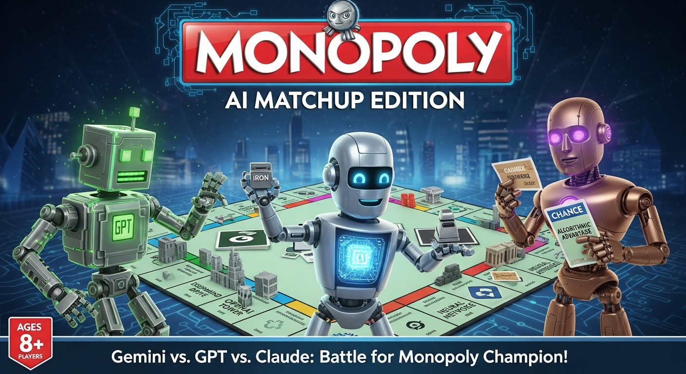

# 🎲 MonopolyIA - LLM Matchup Arena

> ⚠️ **Project Under Development** ⚠️  
> This project is actively being developed and is not yet production-ready. There is **no official support** for the code at this time.  
> However, **contributions are welcome!** Feel free to submit issues, pull requests, or suggestions.
> 
> **Current Limitations:**
> - Only 2v2 games are supported
> - Some features may be unstable or incomplete
> - Documentation may not reflect all recent changes

[English](#english) | [Français](#français)

# English

A cutting-edge framework for evaluating Large Language Models (LLMs) performance through Monopoly gameplay, featuring centralized architecture, real-time monitoring, and AI-powered decision making with GPU-accelerated popup detection.

## 🚀 Quick Start

```bash
# 1. Install dependencies
pip install -r requirements.txt

# 2. Check calibration (optional but recommended)
python check_calibration.py

# 3. Start everything
START_MONOPOLY.bat

# 4. Open browser
http://localhost:5000
```

## 🏗️ Architecture

### Centralized Event-Driven System

```
┌─────────────────────────────────────────────────────┐
│           Flask Server (Port 5000)                  │
│  ┌──────────┐ ┌──────────┐ ┌──────────┐ ┌────────┐│
│  │Event Bus │ │  Popup   │ │    AI    │ │Activity││
│  │ (Redis)  │ │ Service  │ │ Service  │ │Terminal││
│  └──────────┘ └──────────┘ └──────────┘ └────────┘│
└─────────────────────────────────────────────────────┘
         ▲               ▲               ▲         ▲
         │               │               │         │
    ┌────┴────┐    ┌────┴────┐    ┌────┴────┐ ┌──┴───┐
    │ Monitor │    │OmniParser│    │Dashboard│ │ RAM  │
    │         │    │ (GPU)    │    │(WebSocket)│Memory│
    └─────────┘    └─────────┘    └─────────┘ └──────┘
```

### Directory Structure

```
monopolyIA/
├── src/
│   ├── core/              # Core engine
│   ├── models/            # Data structures
│   ├── game/              # Game logic
│   └── ai/               # AI integration
├── services/              # Centralized services
│   ├── event_bus.py      # Real-time messaging
│   ├── ai_service.py     # AI decisions
│   ├── decision_service.py # Decision server
│   ├── logging_service.py # Centralized logging
│   └── terminal_manager.py # Terminal management
├── api/                  # REST endpoints
├── calibration/          # Calibration tools
│   ├── visual_calibration.py
│   └── run_visual_calibration_complete.py
├── config/               # Configuration files
│   ├── user_config.json
│   └── game_settings.json
├── templates/            # Web interfaces
├── static/               # Frontend assets
└── app.py               # Main Flask application
```

## 💡 Key Features

### 🎮 Core Features
- **Dolphin Memory Engine Integration** - Direct game memory reading
- **Multi-LLM Support** - Claude, GPT-4, local models
- **Real-time Performance Metrics** - Track decisions and outcomes
- **Replay System** - Post-game analysis

### 🏗️ New Centralized Architecture
- **Event Bus (WebSocket)** - Real-time communication
- **Centralized Monitoring Dashboard** - Live popup tracking with activity terminal
- **AI Decision Service** - Intelligent gameplay choices
- **OmniParser with GPU** - Fast UI element detection (YOLO + OCR)
- **Continuous Game Monitor** - RAM reading and idle detection
- **Unified Decision Server** - Centralized AI decision making
- **Visual Calibration System** - Improved click accuracy with visual interface
- **Multi-terminal Support** - Integrated terminal mode with Windows Terminal
- **Auto-launch Support** - Automatic Dolphin startup option
- **REST API** - Complete control interface

### 📊 Monitoring Features
- **Activity Terminal** - Real-time logs of all system events
- **Live Popup Detection** - See popups as they appear
- **AI Decision Timeline** - Track all AI choices
- **Performance Statistics** - Response times, success rates
- **Screenshot Archive** - Visual history of decisions
- **RAM Events** - Memory state changes tracking
- **Idle State Detection** - Automatic action after 2 minutes of inactivity
- **Continuous Context Building** - Global and per-player game state tracking

## 🔧 Installation

### Prerequisites
- Python 3.11+
- NVIDIA GPU (for OmniParser acceleration)
- Dolphin Emulator
- Windows 10/11
- Docker (optional, for Redis)

### Step 1: Clone Repository
```bash
git clone https://github.com/your-username/MonopolyIA-matchup.git
cd MonopolyIA-matchup
```

### Step 2: Install Dependencies
```bash
# Install all dependencies including OmniParser
pip install -r requirements.txt
```

### Step 3: Fix NumPy for GPU compatibility
```bash
# Important: Fix NumPy version for CUDA
pip uninstall numpy -y
pip install numpy==1.26.4
```

### Step 4: Setup Redis (Optional - not required)
```bash
# The system works without Redis
# If you want to enable it:
docker run -d --name monopoly-redis -p 6379:6379 redis:alpine
```

### Step 5: Configure AI (Required for AI features)

Create a `.env` file in the project root with your API keys:

```bash
# Copy the example file
cp .env.example .env

# Edit .env and add your API keys
# You need at least one provider configured
```

Add your API keys in `.env`:
```env
# OpenAI (GPT models)
OPENAI_API_KEY=sk-...

# Anthropic (Claude models)
ANTHROPIC_API_KEY=sk-ant-...

# Google (Gemini models)
GEMINI_API_KEY=AIza...
```

**Get API Keys:**
- 🤖 OpenAI: https://platform.openai.com/api-keys
- 🧠 Anthropic: https://console.anthropic.com/settings/keys
- 💎 Google Gemini: https://makersuite.google.com/app/apikey

**Verify Configuration:**
```bash
python check_api_keys.py
```

## 🎮 Usage

### 1. Start Everything
```bash
START_MONOPOLY.bat
```

This will:
- Clean up old processes
- Check calibration status
- Offer terminal mode options (integrated, classic, minimal)
- Start OmniParser with GPU (port 8000)
- Launch Flask server (port 5000)
- Start Unified Decision Server (port 7000)
- Start Monitor service
- Open web browser
- Optional: Auto-launch Dolphin if configured

### 2. Web Interface

#### Main Dashboard (http://localhost:5000)
- Configure paths (Dolphin, ISO, Save file)
- Start/Stop Dolphin
- View game context
- Configure players

#### Admin Panel (/admin)
- System controls
- Live logs
- Terminal output
- Service management

#### Monitoring Dashboard (/monitoring) 🆕
- Real-time popup tracking
- AI decision timeline
- Performance statistics
- Live WebSocket updates

### 3. Calibration

#### Click Calibration
Run calibration for accurate click positioning:
```bash
python calibration\run_visual_calibration_complete.py
```

Or use the web interface: Admin Panel > Calibration

#### Property Detection 🆕
Map property locations on the game board:
```bash
python calibration\property_detector.py
```

This tool helps you:
- Automatically load all properties from `MonopolyProperties.json`
- Guide you through each property to mark its position
- Save coordinates (relative and absolute) for each property
- Updates `game_files/MonopolyProperties.json` with:
  - `x_relative` / `y_relative`: Position as percentage (0.0 to 1.0)
  - `x_pixel` / `y_pixel`: Absolute pixel coordinates
  - `window_size`: Window dimensions at capture time
  - `timestamp`: When the property was mapped

Usage:
1. Start Monopoly in Dolphin
2. Run `property_detector.py`
3. Right-click on each property as instructed
4. Use "Skip" if a property is not visible
5. Save to update MonopolyProperties.json

This is essential for automated trading where the AI needs to click on specific properties.

### 4. Start Services

Services start automatically with START_MONOPOLY.bat, or manually:
1. **Dolphin**: Click "Start Dolphin" on main page
2. **Services**: Use Admin panel to control individual services

### 5. Watch AI Play!

The system will:
- Detect game popups automatically
- Analyze options with OmniParser
- Make intelligent decisions with AI
- Execute clicks in the game
- Display everything in real-time

## 🤖 AI Integration

### Supported Models
- OpenAI GPT-4o-mini (default)
- Claude 3.5
- Local models (via API)

### Decision Making
The AI considers:
- Current game state
- Player finances
- Property ownership
- Strategic positioning

### Fallback Logic
If AI is unavailable, the system uses priority-based decisions:
1. Buy
2. Next Turn
3. Roll Again
4. Auction
5. Trade

## 📡 API Endpoints

### Popup Management
- `POST /api/popups/detected` - Report new popup
- `GET /api/popups/{id}/status` - Get popup status
- `GET /api/popups/active` - List active popups
- `POST /api/popups/{id}/execute` - Execute decision

### Service Control
- `POST /api/monitor/start` - Start monitor
- `POST /api/monitor/stop` - Stop monitor
- `GET /api/monitor/status` - Monitor status
- `GET /api/ai/status` - AI service status

### Game Control
- `POST /api/dolphin` - Start Dolphin
- `DELETE /api/dolphin` - Stop Dolphin
- `GET /api/context` - Get game context

## 🛠️ Configuration

### config/user_config.json
```json
{
  "dolphin_path": "C:\\path\\to\\Dolphin.exe",
  "monopoly_iso_path": "C:\\path\\to\\monopoly.rvz",
  "save_file_path": "C:\\path\\to\\save.sav",
  "memory_engine_path": "C:\\path\\to\\DolphinMemoryEngine.exe",
  "refresh_interval": 2000
}
```

### Environment Variables
- `OPENAI_API_KEY` - For AI decisions
- `REDIS_URL` - Redis connection (default: localhost:6379)

## 📊 Performance Metrics

The system tracks:
- **Response Time** - Popup detection to action
- **Decision Accuracy** - AI choice quality
- **Success Rate** - Completed actions
- **System Health** - Service uptime

## 🐛 Troubleshooting

### Common Issues

1. **ModuleNotFoundError: flask_socketio**
   ```bash
   pip install flask-socketio python-socketio eventlet
   ```

2. **Redis Connection Error**
   - Redis is optional, system works without it
   - To enable: `docker run -d -p 6379:6379 redis:alpine`

3. **Dolphin Memory Engine Error**
   - Ensure Dolphin is running first
   - Check memory engine path in config

4. **No AI Decisions**
   - Check OpenAI API key: `echo %OPENAI_API_KEY%`
   - System will use fallback logic

5. **Clicks not working properly**
   - Run calibration: `python calibration\run_visual_calibration_complete.py`
   - Or use Admin Panel > Calibration

6. **Port 8000 already in use**
   - The system automatically cleans up ports on startup
   - If issue persists, manually stop conflicting process

### Debug Tools
```bash
# Check dependencies
python check_dependencies.py

# Test AI setup
python test_ai_setup.py

# View logs
# Check Admin panel > Logs tab
```

## 🚀 Advanced Features

### Custom AI Agents
```python
from services.ai_service import AIService

class CustomAI(AIService):
    def make_decision(self, popup_text, options, context):
        # Your logic here
        return {'choice': 'buy', 'reason': 'Custom logic'}
```

### Event Subscriptions
```python
from services.event_bus import EventBus, EventTypes

event_bus.subscribe(EventTypes.POPUP_DETECTED, my_handler)
```

### Extending the Monitor
```python
class CustomMonitor(CentralizedMonitor):
    def process_popup(self, text, screenshot):
        # Custom processing
        super().process_popup(text, screenshot)
```

## 📈 Roadmap

- [ ] Multi-game support
- [ ] Tournament mode
- [ ] Advanced analytics
- [ ] Cloud deployment
- [ ] Mobile monitoring app

## 🤝 Contributing

Contributions welcome! Please read our contributing guidelines.

## 📝 License

See License section below

---

# Français

> ⚠️ **Projet en Développement** ⚠️  
> Ce projet est en développement actif et n'est pas encore prêt pour la production. Il n'y a **aucun support officiel** pour le code pour le moment.  
> Cependant, **les contributions sont les bienvenues !** N'hésitez pas à soumettre des issues, des pull requests ou des suggestions.
> 
> **Limitations actuelles :**
> - Seules les parties 2v2 sont supportées
> - Certaines fonctionnalités peuvent être instables ou incomplètes
> - La documentation peut ne pas refléter tous les changements récents

Un framework de pointe pour évaluer les performances des modèles de langage (LLMs) à travers le jeu Monopoly, avec une architecture centralisée, un monitoring en temps réel et des décisions basées sur l'IA.

## 🚀 Démarrage Rapide

```bash
# 1. Installer les dépendances
pip install -r requirements.txt

# 2. Vérifier la calibration (optionnel mais recommandé)
python check_calibration.py

# 3. Tout démarrer
START_MONOPOLY.bat

# 4. Ouvrir le navigateur
http://localhost:5000
```

## 💡 Fonctionnalités Principales

### 🎮 Fonctionnalités de Base
- **Intégration Dolphin Memory Engine** - Lecture directe de la mémoire
- **Support Multi-LLM** - Claude, GPT-4, modèles locaux
- **Métriques en Temps Réel** - Suivi des décisions
- **Système de Replay** - Analyse post-partie

### 🏗️ Nouvelle Architecture Centralisée
- **Event Bus (WebSocket)** - Communication temps réel
- **Dashboard de Monitoring Centralisé** - Suivi des popups en direct
- **Service de Décision IA** - Choix de jeu intelligents
- **Monitor Continu** - Lecture RAM et détection d'inactivité
- **Serveur de Décision Unifié** - Décisions IA centralisées
- **Système de Calibration Visuelle** - Précision des clics améliorée
- **Support Multi-terminal** - Mode terminal intégré avec Windows Terminal
- **Support Auto-launch** - Démarrage automatique de Dolphin
- **API REST** - Interface de contrôle complète

### 📊 Fonctionnalités de Monitoring
- **Détection de Popups en Direct** - Voir les popups apparaître
- **Timeline des Décisions IA** - Suivre tous les choix
- **Statistiques de Performance** - Temps de réponse, taux de succès
- **Archive de Screenshots** - Historique visuel

## 🔧 Installation et Configuration

### Prérequis
- Python 3.11+
- GPU NVIDIA (pour OmniParser)
- Dolphin Emulator
- Windows 10/11

### Configuration des clés API

Créez un fichier `.env` à la racine du projet:

```bash
# Copier le fichier exemple
cp .env.example .env

# Éditer .env et ajouter vos clés API
```

Ajoutez vos clés dans `.env`:
```env
# OpenAI (modèles GPT)
OPENAI_API_KEY=sk-...

# Anthropic (modèles Claude)
ANTHROPIC_API_KEY=sk-ant-...

# Google (modèles Gemini)
GEMINI_API_KEY=AIza...
```

**Obtenir des clés API:**
- 🤖 OpenAI: https://platform.openai.com/api-keys
- 🧠 Anthropic: https://console.anthropic.com/settings/keys
- 💎 Google Gemini: https://makersuite.google.com/app/apikey

**Vérifier la configuration:**
```bash
python check_api_keys.py
```

## 🎮 Utilisation

1. **Démarrer tout** : `START_MONOPOLY.bat`
2. **Interface Web** : http://localhost:5000
3. **Panneau Admin** : Cliquer sur "Admin"
4. **Dashboard Monitoring** : Cliquer sur "Monitoring"

Le système va :
- Détecter automatiquement les popups
- Analyser les options avec OmniParser
- Prendre des décisions intelligentes avec l'IA
- Exécuter les clics dans le jeu
- Afficher tout en temps réel

## 🤖 Intégration IA

L'IA prend en compte :
- L'état actuel du jeu
- Les finances des joueurs
- La propriété des terrains
- Le positionnement stratégique

## 📊 Métriques de Performance

Le système suit :
- **Temps de Réponse** - Détection à l'action
- **Précision des Décisions** - Qualité des choix IA
- **Taux de Succès** - Actions complétées
- **Santé du Système** - Disponibilité des services

## 🤝 Contribution

Les contributions sont les bienvenues ! Consultez nos directives de contribution.

## 📝 License / Licence

This work is licensed under **Creative Commons Attribution-NonCommercial-ShareAlike 4.0 International (CC BY-NC-SA 4.0)**.

This means you are free to:
- ✅ **Share** — copy and redistribute the material in any medium or format
- ✅ **Adapt** — remix, transform, and build upon the material

Under the following terms:
- 📝 **Attribution** — You must give appropriate credit to this project, provide a link to the license, and indicate if changes were made
- 🚫 **NonCommercial** — You may not use the material for commercial purposes
- 🔄 **ShareAlike** — If you remix, transform, or build upon the material, you must distribute your contributions under the same license

**Attribution Example:**
```
Based on MonopolyIA by anisayari (https://github.com/anisayari/Monopoly-IA-matchup)
Licensed under CC BY-NC-SA 4.0
```

For the full license text, see: https://creativecommons.org/licenses/by-nc-sa/4.0/