# Monopoly AI State Machine - Visual Flow Diagram

## Complete State Flow with Decision Points

```mermaid
graph TB
    Start([AI_Turn]) --> Sense[SenseState<br/>Gather game info]
    Sense --> JailCheck{In Jail?}
    
    %% Jail Branch
    JailCheck -->|Yes| JailDec[JailDecision]
    JailDec --> EvalRelease[EvaluateReleaseOptions<br/>🤖 AI DECISION]
    EvalRelease -->|Has Card| UseCard[JD_UseCard]
    EvalRelease -->|Has $50| PayBail[JD_PayBail]
    EvalRelease -->|Roll| Roll[JD_Roll]
    
    UseCard --> Released[JD_Released]
    PayBail --> Released
    Roll -->|Doubles| Released
    Roll -->|No Doubles| JailEnd[JD_EndTurn]
    JailEnd --> End([Turn End])
    
    Released --> Dice
    
    %% Normal Turn Branch
    JailCheck -->|No| Dice[DiceRoll<br/>Roll 2d6]
    Dice --> Move[MoveToken<br/>Update position]
    Move --> Landing{LandingDecision<br/>What square?}
    
    %% Landing Branches
    Landing -->|Property| PropCheck{LD_PropertyCheck<br/>Who owns?}
    Landing -->|Tax| Tax[LD_TaxBranch<br/>Pay tax]
    Landing -->|Special| Special[LD_Special<br/>Execute effect]
    Landing -->|Other| Owned[LD_Owned]
    
    %% Property Ownership Branches
    PropCheck -->|Unowned| BuyBranch[LD_BuyBranch]
    PropCheck -->|Mine| Owned
    PropCheck -->|Opponent's| RentBranch[LD_RentBranch]
    
    %% Buy Decision
    BuyBranch --> EvalBuy[LD_EvalLiquidity<br/>🤖 AI DECISION<br/>Buy property?]
    EvalBuy -->|Yes| Purchase[LD_Purchase<br/>Buy property]
    EvalBuy -->|No| Auction[LD_Auction]
    
    %% Rent Payment
    RentBranch --> PayRent[LD_PayRent<br/>Calculate & pay]
    PayRent --> CheckCash{LD_CheckCash<br/>Cash < 0?}
    CheckCash -->|Yes| Mortgage[LD_Mortgage<br/>🤖 AI DECISION<br/>What to mortgage?]
    CheckCash -->|No| Done
    Mortgage --> PayAfter[LD_PayAfterMort]
    
    %% Complete Landing
    Purchase --> Done[LD_Done]
    Auction --> Done
    Owned --> Done
    Tax --> Done
    Special --> Done
    PayAfter --> Done
    
    Done --> Exit[LD_Exit]
    Exit --> PostTurn[PostTurnManagement]
    
    %% Post Turn Management
    PostTurn --> ImpCheck{PTM_ImprovementCheck<br/>Can improve?}
    ImpCheck -->|Has Monopoly| BuildBranch[PTM_BuildBranch]
    ImpCheck -->|Trade Available| TradeBranch[PTM_TradeBranch]
    ImpCheck -->|Neither| PTMEnd[PTM_End]
    
    %% Building Branch
    BuildBranch --> EvalROI[PTM_EvalROI<br/>🤖 AI DECISION<br/>Build houses?]
    EvalROI -->|Yes| Build[PTM_Build<br/>Build improvements]
    EvalROI -->|No| Skip[PTM_Skip]
    Build --> BuildEnd[PTM_BuildEnd]
    Skip --> BuildEnd
    BuildEnd --> ImpCheck
    
    %% Trading Branch
    TradeBranch --> FindPartner[PTM_FindPartner<br/>🤖 AI DECISION<br/>Who to trade with?]
    FindPartner -->|Found| MakeOffer[PTM_MakeOffer<br/>🤖 AI DECISION<br/>What to offer?]
    FindPartner -->|None| NoTrade[PTM_NoTrade]
    MakeOffer --> Wait[PTM_Wait]
    Wait -->|Accepted| Accepted[PTM_Accepted]
    Wait -->|Rejected| Rejected[PTM_Rejected]
    Accepted --> Update[PTM_UpdateHold]
    Update --> TradeEnd[PTM_TradeEnd]
    Rejected --> TradeEnd
    NoTrade --> TradeEnd
    TradeEnd --> ImpCheck
    
    %% End of Turn
    PTMEnd --> PTMExit[PTM_Exit]
    PTMExit --> DoubleCheck{DoubleCheck<br/>Rolled doubles?}
    DoubleCheck -->|Yes & < 3| Dice
    DoubleCheck -->|Yes & = 3| Prison[DC_Prison<br/>Go to jail!]
    DoubleCheck -->|No| TurnEnd[TurnEnd]
    Prison --> End
    TurnEnd --> End
    
    %% Styling
    classDef decision fill:#ff9,stroke:#333,stroke-width:3px
    classDef ai fill:#9f9,stroke:#333,stroke-width:4px
    classDef terminal fill:#f99,stroke:#333,stroke-width:2px
    
    class EvalRelease,EvalBuy,Mortgage,EvalROI,FindPartner,MakeOffer ai
    class Start,End terminal
    class JailCheck,Landing,PropCheck,CheckCash,ImpCheck,DoubleCheck decision
```

## Key Decision Points

### 🤖 AI-Powered Decisions (Green nodes)

1. **EvaluateReleaseOptions** - Jail escape strategy
   - Input: Cash, jail cards, turns in jail
   - Output: use_card | pay_bail | roll_dice

2. **LD_EvalLiquidity** - Property purchase decision
   - Input: Property price, current cash, color group status
   - Output: buy | pass

3. **LD_Mortgage** - Mortgage selection
   - Input: Cash needed, property values, monopoly status
   - Output: List of properties to mortgage

4. **PTM_EvalROI** - Building decision
   - Input: Cash, monopolies owned, building costs
   - Output: build (with details) | skip

5. **PTM_FindPartner** - Trade partner selection
   - Input: All players' properties, monopoly potentials
   - Output: Player ID | none

6. **PTM_MakeOffer** - Trade proposal
   - Input: Partner's needs, own assets
   - Output: Trade offer details

### 🔶 Branching Decisions (Yellow nodes)

These are simple conditional checks:
- **JailCheck**: Am I in jail?
- **LandingDecision**: What type of square?
- **LD_PropertyCheck**: Who owns this property?
- **LD_CheckCash**: Do I have negative cash?
- **PTM_ImprovementCheck**: Can I build or trade?
- **DoubleCheck**: Did I roll doubles?

### 🔴 Terminal States (Red nodes)

- **Start** (AI_Turn): Beginning of turn
- **End**: Turn complete

## State Categories by Function

### Information Gathering
- SenseState
- JailCheck
- LandingDecision
- LD_PropertyCheck

### Action Execution
- DiceRoll
- MoveToken
- LD_Purchase
- LD_PayRent
- PTM_Build

### Decision Making
- EvaluateReleaseOptions 🤖
- LD_EvalLiquidity 🤖
- LD_Mortgage 🤖
- PTM_EvalROI 🤖
- PTM_FindPartner 🤖
- PTM_MakeOffer 🤖

### Flow Control
- AI_Turn
- LD_Done / LD_Exit
- PTM_BuildEnd / PTM_TradeEnd
- TurnEnd

## Loops in the State Machine

1. **Doubles Loop**: DoubleCheck -> DiceRoll (max 3 times)
2. **Building Loop**: PTM_BuildEnd -> PTM_ImprovementCheck
3. **Trading Loop**: PTM_TradeEnd -> PTM_ImprovementCheck

These loops allow multiple actions in a single turn when appropriate.